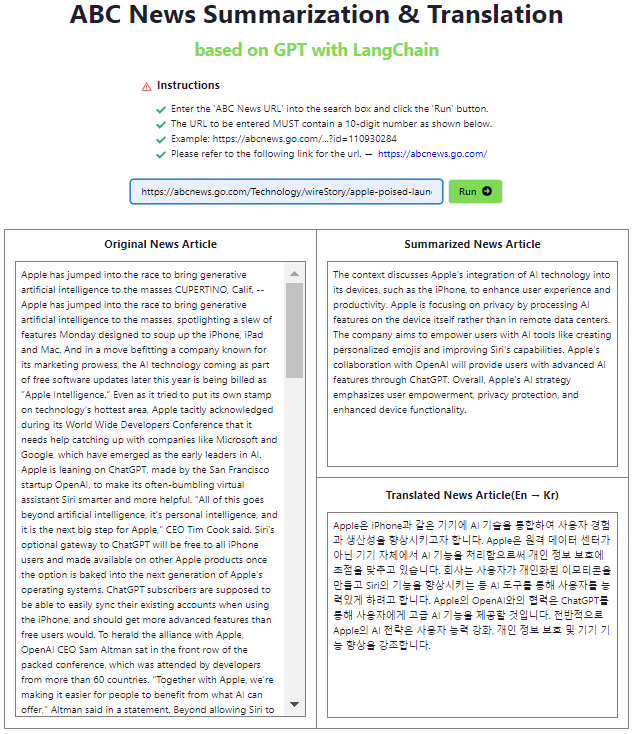

## ▷ 목차

---

1. [프로젝트명](#1-프로젝트-명)
2. [주요기능 및 목적](#2-주요기능-및-목적)
   - 2.1 [프로젝트 목적](#21-프로젝트-목적)
   - 2.2 [주요 기능 및 설명](#22-주요-기능-및-설명)
   - 2.3 [개선해야할 부분](#23-개선해야할-부분)
3. [회고](#3-회고)
   - 3.1 [Backend](#31-Backend)
   - 3.2 [LangChain(LLM)](<#32-LangChain(LLM)>)
   - 3.3 [Frontend](#33-Frontend)
   - 3.4 [Cloud Architecture](#34-Cloud-Architecture)
4. [설치 및 실행 방법](#4-설치-및-실행-방법)
   - 4.1 [backend 디렉토리](#41-backend-디렉토리)
   - 4.2 [frontend 디렉토리](#42-frontend-디렉토리)
5. [참고](#5-참고)

## 1. 프로젝트 명

---

- **LangNews**: LangChain을 활용한 뉴스 기사 번역 및 요약 기능을 제공하는 애플리케이션

## 2. 주요기능 및 목적

---

### 2.1 프로젝트 목적

- 지난 NLP 프로젝트 회고에서 얻은 경험을 바탕으로 새로운 프로젝트를 시작하게 되었습니다. 지난 회고에서 목적에 맞게 모델을 튜닝하는 데 필요한 컴퓨팅 자원과 시간이 부족하다는 문제를 극복하기 위해, **Prompt Engineering** 기술을 도입하기로 했습니다. 이는 사용자가 원하는 결과를 얻기 위해 입력 문장을 설계하고 최적화하는 과정으로, **부족한 컴퓨팅 자원을 극복함과 동시에 최적화된 LLM을 개발하는 데 도움**이 될 것입니다. 따라서 대규모 언어 모델(LLM)을 활용한 애플리케이션을 개발하기 위해 **LangChain**을 사용하기로 결정했습니다.

- 또한 이전의 NLP 프로젝트에서는 주로 모델 튜닝 결과를 화면에 보여주는 방식이었지만, 이번 프로젝트에서는 모델뿐만 아니라 **백엔드와 프론트엔드를 직접 구현하여 완전한 애플리케이션을 만들어**보기로 목표를 설정했습니다. 이를 통해 **문제를 스스로 발굴, 해결 그리고 개선**하여 보다 완벽한 애플리케이션을 구축하는 경험을 통해서 AI 개발자로서의 역량을 성장시키고자 했습니다.

### 2.2 주요 기능 및 설명

- 2.2.1 Backend

  - **Django REST Framework**를 사용하여 구현했으며 backend 디렉토리 내에 users, boards, models로 구성됩니다. 대표적인 users와 boards의 설명은 다음과 같습니다.(models는 다음 목차에서 설명합니다.)
    - users(사용자): 사용자 관련된 필드를 models.py에 정의하고 이를 바탕으로 사용자 데이터를 직렬화하는 클래스를 serializers.py에 정의했습니다. 그리고 views.py에서 사용자 인증(로그인, 로그아웃), 소셜 로그인, 프로필 보기 및 수정, 비밀번호 변경 등 APIView 클래스들이 정의했습니다.
    - boards(게시판 및 댓글): 게시판 및 댓글 관련 필드들을 models.py에 정의하고 이를 바탕으로 게시글과 댓글 데이터를 직렬화 하는 클래스를 serializers.py에 정의했습니다. 그리고 views.py에서 게시글과 댓글의 CRUD를 APIView 클래스를 사용하여 구현하였으며 댓글의 좋아요 생성 및 추가 기능도 구현하였습니다.

- 2.2.2 LangChain(LLM)

  - backend/models 디렉토리의 services.py 에 **LangChain**의 핵심 로직 및 기능을 정의하였고 대표적인 기능을 다음과 같습니다.
    - 뉴스 기사 요약: 뉴스 기사 URL에서 기사를 추출, 캐시 저장, 텍스트 분할 및 임베딩한 후 retriever를 생성하고, 이를 바탕으로 RAG(Retrieval-Augmented Generation) 기법을 통해 기사를 요약하여 반환하는 기능
    - 뉴스 기사 번역: 요약된 기사를 한국어로 번역하기 위해 템플릿과 모델을 사용하여 체인을 생성하고, 이를 실행하여 번역된 기사를 반환하는 기능
  - services.py에 정의한 함수들은 views.py에 각 클래스로 정의되어 클라이언트의 요청받아 적절한 HTTP 응답을 반환합니다. 그리고 urls.py에서 URL 패턴에 매핑하여 클라이언트 요청을 해당 뷰로 라우팅합니다.
  - 위의 과정을 거쳐 화면에 보이는 기사 요약 및 번역 대한 샘플 이미지는 다음과 같습니다.(클릭하면 더 자세히 보실 수 있습니다.)
  <p align="center">
    
    
    
  </p>

- 2.2.3 Frontend
  - **TypeScript** 기반 **React**를 사용하여 구현하였습니다. 주요 디렉토리 및 파일 설명은 다음과 같습니다.
    - api dir: axios를 사용하여 HTTP 요청을 보내기 위한 인스턴스를 생성하고 서버와의 통신을 위한 API 호출 함수들을 정의했습니다. 크게 boardAPI, commentAPI, modelAPI, socialAPI, userAPI로 나뉩니다.
    - components dir: 로그인, 로그아웃, 게시판, 댓글 그리고 기본 UI 관련 코드들을 정의한 폴더입니다. 게시판 및 댓글과 관련된 코드는 별도로 boards와 comments 디렉토리에 정리하였습니다.
    - routes dir: routes.tsx에서 경로에 대한 요소들을 정리한 디렉토리입니다. 게시판, 댓글 등이 있으며 신문기사 요약 및 번역에 대한 경로는 LLMRoutes.tsx입니다.
    - lib/useUser.ts: useQuery hook을 사용하여 서버로부터 사용자 프로필 정보를 비동기적으로 가져옵니다.
    - routes.tsx: createBrowserRouter를 사용하여 라우터를 생성하고, 각 경로에 대한 요소(element)를 지정하고 렌더링합니다.
    - types.d.ts: 애플리케이션에서 사용하는 데이터 타입을 정의한 파일입니다.

### 2.3 개선해야할 부분

- 2.3.1 Backend
  - Transaction 사용: DB 관련 작업이 하나의 논리적 단위로 실행됨으로써 데이터의 원자성을 보장하도록 코드를 수정해야할 것 같습니다.
  - Queryset 활용: Queryset 관련 문법을 정확히 숙지할 필요를 느꼈습니다. 그리고 지연 평가(Lazy Evaluation), 체이닝(Chaining)등 여러 기법들을 익힌다면 DB에 데이터 접근을 효율적이고 안전하게 처리할 수 있다고 생각했습니다.
- 2.3.2 LangChain(LLM)
  - 성능 측정: 뉴스기사(Feature)와 요약된 기사(Target)를 준비해서 Feature를 RAG 기법을 통해 나온 결과와 Target과의 BLEU(Bilingual Evaluation Understudy) 혹은 ROUGE(Recall-Oriented Understudy for Gisting Evaluation) Score 측정을 통해 성능을 향상 및 최적화한다면 좋겠다는 생각을 했습니다.
  - Request Blocked: ABC 뉴스 홈페이지의 url을 통해 기사 번역과 요약이 되는거라 계속 사용하면 나중에 해당 사이트 자체에서 접근을 제한해버립니다. 이는 범용성이 떨어지는 부분으로써 url 말고 텍스트를 input으로 대체하는 등 다른 방법을 강구해야할 것으로 보입니다. 또한 저작권 문제가 발생할 수 있어 주의해야할 것 같습니다.
- 2.3.3 Frontend
  - 코드 분리 필요: 코드 자체에 css 요소들을 넣다보니 가독성이 안 좋은 부분이 있어 css 파일을 따로 분리하면 좋겠다고 느꼈습니다. 또한 component에 코드가 중복된 부분이 있어 재사용 목적에 맞게 이를 분리 및 수정할 필요성이 보입니다.
  - Simple-JWT 사용: Backend에 구현했지만 Frontend에 구현하지 못한 부분이 아쉽습니다. 추후 토큰 인증을 사용하여 사용자의 접근을 제어한다면 보안적으로 강화시킬 수 있을 것 같습니다.
  - 권한 관련 처리: 게시글이 비공개일 때와 같이 권한이 없을 경우에 대응되는 메시지를 toast나 401 페이지로 라우팅되도록 설정이 필요하다고 느꼈습니다.

## 3. 회고

---

### 3.1 Backend

- 배운 내용을 참고하여 게시판을 만들때, 기사 url을 POST 요청해 해당 view로 보내면 LangChain 통해 요약 및 번역이 진행되어 결과를 반환하도록 스스로 설계하고 구현했을 때 재미를 느꼈습니다. 개발하면서 느낀점은 DB와 상호작용을 위해 SQL에 대한 이해가 중요하다는 것입니다. Django는 직접 SQL을 사용하기 보다는 DB와 상호작용을 위해 모델과 쿼리셋을 사용하는데 이 때 SQL 쿼리에 대한 이해가 필요하다고 생각합니다. 그리고 SQL 쿼리에 대해 이해한다면 복잡한 쿼리나 성능 최적화를 위해 직접 쿼리를 작성할 때도 도움이 될 것 같습니다. 또한 Mixins, Generic Views, APIView의 각 특성을 이해하고 프로젝트의 요구사항에 맞춰 적절히 활용해 더 효율적인 RESTful API를 구축해보고 싶습니다. 

### 3.2 LangChain(LLM)

- 프로젝트 목적에 맞게 번역 및 요약이 잘 되는것 같아 만족스러웠습니다. 하지만 위에서 언급한 성능측정을 통한 최적화가 진행되었다면 좋겠다는 아쉬움이 있습니다.
- 이번 계기를 통해 전체적이고 기초적인 LangChain의 개념에 대해 접했다면 LangChain에서 제공하는 모듈(Model I/O, Retrieval, Memory, Chains, Agents, Callbacks)과 RAG, ReAct와 같은 기법들을 좀 더 심도있게 학습해서 효율적인 LLM 애플리케이션을 만들고 싶습니다.
- Prompt Engineering 관련 논문을 통해 다양한 기법과 전략을 학습하여 LLM 애플리케이션에 적용해보고 싶습니다.

### 3.3 Frontend

- 게시판, 댓글, 기사 번역 및 요약 페이지를 구성하면서 어려움도 느꼈지만 직접 구현하는 재미를 느꼈습니다. 하지만 React에 대해 정확히 알지는 못하지만 배운 내용을 바탕으로 직관적으로 코드를 작성한 느낌이 있었습니다. 따라서 React 및 TypeScript 문법 및 Hooks와 같은 기능들을 정확히 숙지해야할 필요성을 느꼈습니다.
- 혼자만의 생각과 느낌으로 개발했지만 앞으로 사전 조사 및 수집한 UX를 바탕으로 UI를 설계했더라면 좀 더 완성도 있게 나오지 않았을까라는 아쉬움이 있습니다.

### 3.4 Cloud Architecture

- 게시판 첨부파일(객체)의 경우, AWS S3와 연동을 했지만 확장시키지 못한 아쉬움이 있습니다. 추후 AWS에 대해 학습하여 보다 완성된 Architecture를 구성해보고 싶습니다. 예를 들어, 첨부파일과 같은 객체는 S3에 저장하고 해당 파일의 메타데이터와 관계형 데이터는 Amazon RDS for PostgreSQL에 저장하여 DB를 구축할 수 있을 것 같습니다.
- 그리고 Frontend와 Backend에 각각 EC2와 같은 서버를 두고 사이에 API Gateway를 둔다면 효율적인 API 개발 및 유연한 보안 제어가 가능할 것 같습니다.
- 그 외에도 사용자 인증 및 권한 관리를 제공하기 위해 Amazon Cognito를 사용하고 시스템 모니터링 및 로그 관리를 위해 CloudWatch를 사용하는 등 여러 클라우드 서비스를 결합하여 배포해보고 싶습니다.

## 4. 설치 및 실행 방법

---

### 4.1 backend 디렉토리

- 가상환경을 설치합니다.

  ```
  python -m venv ./env
  ```

- requirements.txt 설치합니다.

  ```
  python -m pip install -r .\requirements.txt
  ```

- 만약 다음과 같이 에러가 발생할 경우, 수동으로 설치합니다.

  - <text> ERROR: ResolutionImpossible: for help visit https://pip.pypa.io/en/latest/topics/dependency-resolution/#dealing-with-dependency-conflicts </text>
  - ```
    python -m pip install -r .\requirements.txt --use-deprecated=legacy-resolver
    ```
    ```
    python -m pip install django djangorestframework djangorestframework-simplejwt
    ```

- backend 디렉토리에 .env 파일 생성후, 파일안에 아래 값을 완성하여 입력합니다.

```
# Django
SECRET_KEY="Use SECRET_KEY in config/settings.py."

# AWS S3
AWS_ACCESS_KEY_ID="After creating an IAM user, a key can be issued."
AWS_SECRET_ACCESS_KEY="After creating an IAM user, a key can be issued."

# Github Social Sign-In
GH_SECRET="Get it from the following url(https://github.com/settings/developers)"

# OpenAI & LangChain
OPENAI_API_KEY="Get it from the following url(https://platform.openai.com/api-keys)"
LANGCHAIN_TRACING_V2=true
LANGCHAIN_ENDPOINT="https://api.smith.langchain.com"
LANGCHAIN_API_KEY="Get it from the following url(https://smith.langchain.com/settings)"
```

- 마이그레이션 파일 생성 및 데이터베이스에 마이그레이션 반영합니다.

```
python manage.py makemigrations
```
```
python manage.py migrate
```

- superuser를 생성합니다.(생성 안하고 회원가입 혹은 소셜로그인 시, 에러가 발생함)

  ```
  python manage.py createsuperuser
  ```

- 만약 다음과 같이 에러가 발생할 경우, 해결방법은 아래와 같습니다.
  - <text> django.db.utils.OperationalError: no such table: users_user </text>
  - ```
    python manage.py migrate --run-syncdb
    ```

### 4.2 frontend 디렉토리

- package.json을 설치 및 서버 실행합니다.

```
npm install --force
```
```
npm run start
```

- 마지막으로 사용시, 주소값을 localhost:3000가 아닌, 127.0.0.1:3000으로 사용합니다.

## 5. 참고

---

##### - 풀스택 GPT: 랭체인으로 AI 웹 서비스 7개 만들기(https://nomadcoders.co/fullstack-gpt)

##### - 풀스택 에어비엔비 클론코딩(https://nomadcoders.co/airbnb-clone)

###### ※ 본 코드는 개인적인 학습을 위해 제작한 것입니다. 따라서 금전적인 목적을 가진 무단 사용 및 복제를 금합니다.
